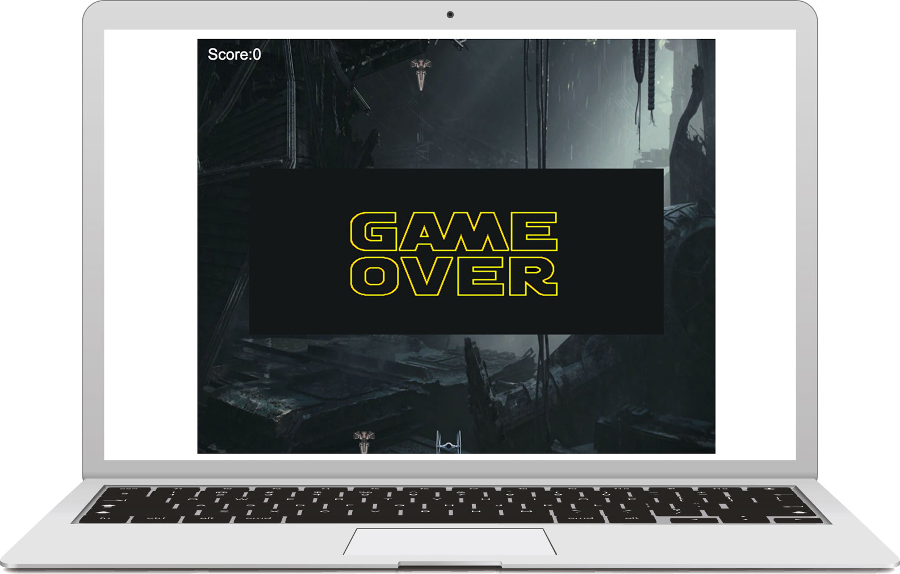

# StarWars Galaxy

### Description

Star Wars Galaxy is a classic arcade-style game where players control a spaceship to defeat waves of enemy spacecraft. The rule is to keep the enemy away from the bottom border and avoid getting hit to survive.

[Demo Link](https://clairegame.netlify.app/)

## Screenshots



### Technologies Used

- HTML5 Canvas

- JavaScript

### Setup

1. Click on `Go live` present at the bottom of VS code.

### Function Flow

```
1. Canvas Setup:

   The canvas element is created and initialized with a rendering context.
   Event listeners are added to handle window resizing.

2. Level Selection:

   Players can select the difficulty level (easy, medium, or hard) before starting the game.
   Level buttons are displayed, and the selected level determines enemy speed and spawn rate.

3. Game Initialization:

   Background music is loaded and played.
   Image assets (background, player spaceship, enemy spacecraft, bullet, game over screen) are loaded.

4. Game Loop:

   The main game loop continuously updates the game state and renders images on the canvas.
   Player input is processed to move the spaceship and fire bullets.
   Enemy spacecraft are spawned at regular intervals based on the selected level.
   Collision detection is performed to check for bullet-enemy and player-enemy collisions.
   Score and level information is displayed on the screen.

5. Game Over:

   Game ends if player spaceship hits enemy or an enemy reaches bottom. Displays game over screen, pauses music.

6. Restarting the Game:

   when it's over, it briefly displays the game over image before automatically reloading.
```

### Credits

- This project was inspired by [HTML5 Canvas and JavaScript Game Tutorial](https://youtu.be/eI9idPTT0c4).
- Background Music: Star Wars Theme Song
- Sound Effects: Spaceship Shooting Sound
- Image Assets: Starwars characters from Google Image

```

```
